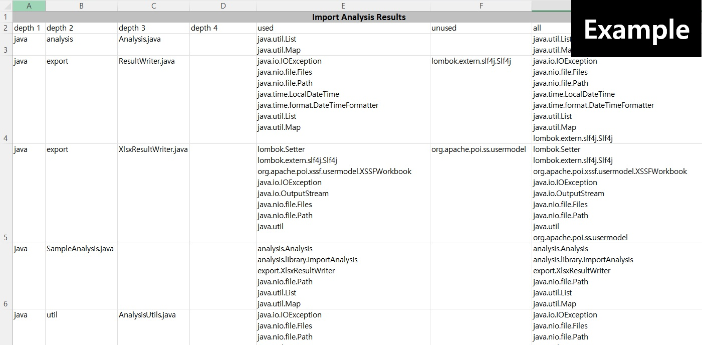

# Java Migration Analysis Tool

자바 프로젝트 마이그레이션 분석을 위한 도구입니다.

JDK 21 환경에서 개발되었습니다. 

---

## 주요 기능

- 자바 소스 코드 import 분석
  - 와일드카드(*)를 사용한 import(예: `java.util.*`)는 미사용 import로 잘못 분류될 수 있습니다.
---

## 사용 예시

```java
Path javaPath = Path.of("C:/xxx/xxx/src/main/java");
Analysis importAnalysis = new ImportAnalysis(javaPath);
List<Map<String, String>> analysisResult = importAnalysis.analyze();

ResultWriter xlsxResultWriter = new XlsxResultWriter();
xlsxResultWriter.exportToDefaultLocation(analysisResult);
```
